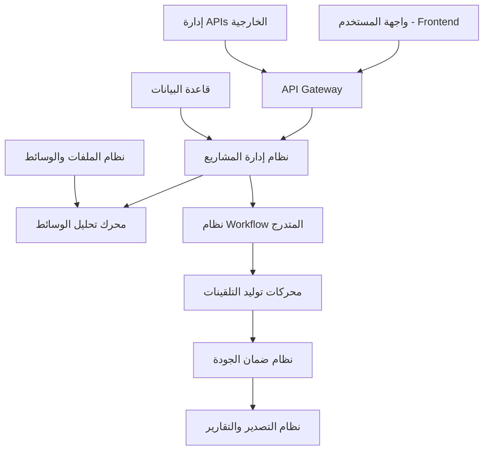
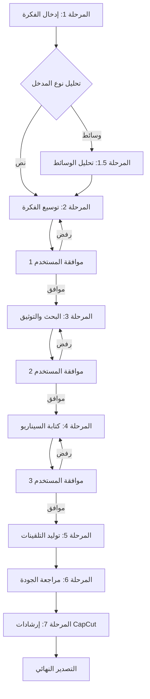
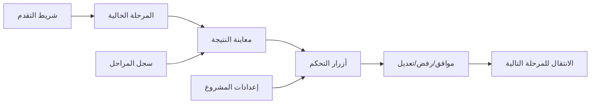

# المخطط المعماري المتكامل لمنصة Chimera

## 🏗️ نظرة عامة على البنية

منصة Chimera هي نظام متكامل لتوليد التلقينات الاحترافية يعمل وفق مبدأ "من الفكرة إلى الإنتاج الكامل" عبر مراحل متتالية مع نقاط موافقة المستخدم.

---

## 🌐 البنية العامة للنظام



---

## 📊 تصميم قاعدة البيانات

### الجداول الأساسية:

#### 1. جدول المستخدمين (users)
```sql
CREATE TABLE users (
    id UUID PRIMARY KEY DEFAULT gen_random_uuid(),
    email VARCHAR(255) UNIQUE NOT NULL,
    username VARCHAR(100) UNIQUE NOT NULL,
    password_hash VARCHAR(255) NOT NULL,
    subscription_plan ENUM('free', 'pro', 'enterprise') DEFAULT 'free',
    created_at TIMESTAMP DEFAULT CURRENT_TIMESTAMP,
    updated_at TIMESTAMP DEFAULT CURRENT_TIMESTAMP
);
```

#### 2. جدول مفاتيح APIs (api_keys)
```sql
CREATE TABLE api_keys (
    id UUID PRIMARY KEY DEFAULT gen_random_uuid(),
    user_id UUID REFERENCES users(id) ON DELETE CASCADE,
    provider ENUM('google_ai_studio', 'openrouter') NOT NULL,
    key_name VARCHAR(100) NOT NULL,
    encrypted_api_key TEXT NOT NULL,
    is_active BOOLEAN DEFAULT true,
    usage_count INTEGER DEFAULT 0,
    rate_limit_remaining INTEGER DEFAULT 1000,
    created_at TIMESTAMP DEFAULT CURRENT_TIMESTAMP
);
```

#### 3. جدول المشاريع (projects)
```sql
CREATE TABLE projects (
    id UUID PRIMARY KEY DEFAULT gen_random_uuid(),
    user_id UUID REFERENCES users(id) ON DELETE CASCADE,
    title VARCHAR(255) NOT NULL,
    description TEXT,
    initial_idea TEXT NOT NULL,
    project_type ENUM('video', 'audio', 'image', 'mixed') NOT NULL,
    status ENUM('idea', 'script', 'prompts', 'completed', 'exported') DEFAULT 'idea',
    current_stage INTEGER DEFAULT 1,
    created_at TIMESTAMP DEFAULT CURRENT_TIMESTAMP,
    updated_at TIMESTAMP DEFAULT CURRENT_TIMESTAMP
);
```

#### 4. جدول مراحل العمل (workflow_stages)
```sql
CREATE TABLE workflow_stages (
    id UUID PRIMARY KEY DEFAULT gen_random_uuid(),
    project_id UUID REFERENCES projects(id) ON DELETE CASCADE,
    stage_number INTEGER NOT NULL,
    stage_name VARCHAR(100) NOT NULL,
    stage_type ENUM('idea_expansion', 'script_generation', 'research', 'video_prompts', 'image_prompts', 'audio_prompts', 'review') NOT NULL,
    input_data JSONB,
    output_data JSONB,
    status ENUM('pending', 'in_progress', 'completed', 'approved', 'rejected') DEFAULT 'pending',
    user_feedback TEXT,
    created_at TIMESTAMP DEFAULT CURRENT_TIMESTAMP,
    completed_at TIMESTAMP
);
```

#### 5. جدول الشخصيات (characters)
```sql
CREATE TABLE characters (
    id UUID PRIMARY KEY DEFAULT gen_random_uuid(),
    project_id UUID REFERENCES projects(id) ON DELETE CASCADE,
    character_name VARCHAR(100) NOT NULL,
    physical_description TEXT NOT NULL,
    personality_traits TEXT,
    voice_characteristics TEXT,
    consistency_key TEXT NOT NULL, -- للحفاظ على تناسق الشخصية
    created_at TIMESTAMP DEFAULT CURRENT_TIMESTAMP
);
```

#### 6. جدول التلقينات المولدة (generated_prompts)
```sql
CREATE TABLE generated_prompts (
    id UUID PRIMARY KEY DEFAULT gen_random_uuid(),
    project_id UUID REFERENCES projects(id) ON DELETE CASCADE,
    stage_id UUID REFERENCES workflow_stages(id) ON DELETE CASCADE,
    prompt_type ENUM('video', 'image', 'audio', 'music', 'sfx') NOT NULL,
    target_platform VARCHAR(50) NOT NULL, -- veo3, imagen4, elevenlabs, etc.
    prompt_text TEXT NOT NULL,
    prompt_parameters JSONB, -- معاملات إضافية
    quality_score DECIMAL(3,2),
    scene_number INTEGER,
    character_id UUID REFERENCES characters(id),
    created_at TIMESTAMP DEFAULT CURRENT_TIMESTAMP
);
```

#### 7. جدول الوسائط المرفوعة (uploaded_media)
```sql
CREATE TABLE uploaded_media (
    id UUID PRIMARY KEY DEFAULT gen_random_uuid(),
    project_id UUID REFERENCES projects(id) ON DELETE CASCADE,
    file_path VARCHAR(500) NOT NULL,
    file_type ENUM('image', 'video', 'audio') NOT NULL,
    file_size BIGINT NOT NULL,
    analysis_result JSONB, -- نتائج تحليل الوسائط
    created_at TIMESTAMP DEFAULT CURRENT_TIMESTAMP
);
```

---

## 🔄 نظام Workflow المتدرج

### مراحل العمل الأساسية:



### تفاصيل كل مرحلة:

#### المرحلة 1: إدخال الفكرة
- **المدخل**: فكرة نصية أو وسائط (صور/فيديو/صوت)
- **المعالجة**: تحليل وتصنيف نوع المحتوى
- **المخرج**: فكرة منظمة مع تحديد النوع والأهداف

#### المرحلة 1.5: تحليل الوسائط (إذا وجدت)
- **المدخل**: ملفات وسائط
- **المعالجة**: 
  - تحليل الصور للاستخراج البصري
  - تحليل الفيديو للأسلوب والحركة
  - تحليل الصوت للنبرة والمشاعر
- **المخرج**: وصف تفصيلي للعناصر المستخرجة

#### المرحلة 2: توسيع الفكرة
- **المدخل**: الفكرة الأساسية + تحليل الوسائط (إن وجد)
- **المعالجة**: استخدام AI لتوسيع الفكرة وإضافة تفاصيل
- **المخرج**: مفهوم موسع مع تحديد الشخصيات والبيئة

#### المرحلة 3: البحث والتوثيق (شرطية)
- **المدخل**: المفهوم الموسع
- **المعالجة**: بحث في الإنترنت للمعلومات الداعمة
- **المخرج**: بيانات وحقائق موثقة لدعم المحتوى

#### المرحلة 4: كتابة السيناريو
- **المدخل**: المفهوم + البحث
- **المعالجة**: إنشاء سيناريو مفصل مع حوارات ووصف مشاهد
- **المخرج**: سيناريو كامل مقسم لمشاهد

#### المرحلة 5: توليد التلقينات
- **المدخل**: السيناريو المعتمد
- **المعالجة**: 
  - تحليل كل مشهد
  - توليد تلقينات متخصصة لكل منصة
  - ضمان تناسق الشخصيات
- **المخرج**: حزمة شاملة من التلقينات

#### المرحلة 6: مراجعة الجودة
- **المدخل**: التلقينات المولدة
- **المعالجة**: تقييم جودة التلقينات وفق المعايير المحددة
- **المخرج**: تلقينات محسنة ومراجعة

#### المرحلة 7: إرشادات CapCut
- **المدخل**: التلقينات النهائية
- **المعالجة**: إنشاء دليل مونتاج مخصص
- **المخرج**: خطة مونتاج تفصيلية

---

## 🤖 محركات توليد التلقينات

### 1. محرك تلقينات الفيديو (Veo3 Engine)
```python
class Veo3PromptEngine:
    def __init__(self):
        self.style_templates = {
            'cinematic': 'cinematic lighting, dramatic angles, professional cinematography',
            'documentary': 'natural lighting, handheld camera, realistic movement',
            'commercial': 'bright lighting, stable shots, dynamic transitions'
        }
    
    def generate_video_prompt(self, scene_data, character_data, style_preference):
        # بناء التلقين وفق أفضل الممارسات
        base_prompt = self._build_base_description(scene_data, character_data)
        camera_work = self._add_camera_techniques(scene_data['action'])
        lighting = self._determine_lighting(scene_data['environment'])
        style = self.style_templates.get(style_preference, '')
        
        return f"{base_prompt}. Camera: {camera_work}. Lighting: {lighting}. Style: {style}"
```

### 2. محرك تلقينات الصور (Imagen4/Flux Engine)
```python
class ImagePromptEngine:
    def __init__(self):
        self.character_consistency_db = {}
    
    def generate_image_prompt(self, scene_data, character_id, platform='imagen4'):
        character_desc = self._get_consistent_character_description(character_id)
        environment = self._describe_environment(scene_data['location'])
        technical_params = self._get_platform_params(platform)
        
        return f"{character_desc} in {environment}. {technical_params}"
    
    def _get_consistent_character_description(self, character_id):
        # استرجاع الوصف الثابت للشخصية
        return self.character_consistency_db.get(character_id, "")
```

### 3. محرك تلقينات الصوت (ElevenLabs Engine)
```python
class AudioPromptEngine:
    def generate_voice_prompt(self, dialogue_data, character_voice, emotion):
        voice_settings = self._get_voice_settings(character_voice)
        emotion_tags = self._process_emotion(emotion)
        timing = self._add_timing_controls(dialogue_data['text'])
        
        return {
            'text': timing,
            'voice': voice_settings,
            'emotion': emotion_tags,
            'settings': self._get_quality_settings()
        }
```

---

## 🔌 نظام إدارة APIs

### مجمع المفاتيح (Key Pool System)
```python
class APIKeyManager:
    def __init__(self):
        self.key_pools = {
            'google_ai_studio': [],
            'openrouter': []
        }
        self.usage_tracker = {}
    
    def get_available_key(self, provider, user_id):
        user_keys = self._get_user_keys(user_id, provider)
        return self._select_best_key(user_keys)
    
    def track_usage(self, key_id, tokens_used):
        # تتبع الاستخدام وإدارة الحدود
        pass
    
    def rotate_keys(self, provider):
        # تدوير المفاتيح للاستفادة القصوى من الحصص المجانية
        pass
```

### واجهة API الموحدة
```python
class UnifiedAPIClient:
    def __init__(self, key_manager):
        self.key_manager = key_manager
        self.providers = {
            'google_ai_studio': GoogleAIStudioClient(),
            'openrouter': OpenRouterClient()
        }
    
    async def generate_content(self, prompt, provider, user_id, model_params=None):
        api_key = self.key_manager.get_available_key(provider, user_id)
        client = self.providers[provider]
        
        try:
            result = await client.generate(prompt, api_key, model_params)
            self.key_manager.track_usage(api_key['id'], result['tokens_used'])
            return result
        except Exception as e:
            # التعامل مع الأخطاء والتبديل للمفتاح التالي
            return await self._handle_api_error(e, prompt, provider, user_id)
```

---

## 📱 تصميم واجهة المستخدم

### الصفحات الرئيسية:

1. **لوحة المشاريع**: عرض جميع المشاريع مع حالة التقدم
2. **إنشاء مشروع جديد**: نموذج لإدخال الفكرة الأولية
3. **واجهة المشروع**: عرض مراحل العمل مع نقاط الموافقة
4. **إدارة المفاتيح**: واجهة لإضافة وإدارة مفاتيح APIs
5. **مكتبة القوالب**: قوالب جاهزة للمشاريع المختلفة
6. **التصدير والتقارير**: تحميل النتائج النهائية

### واجهة العمل التفاعلية:


---

## 🔍 نظام تحليل الوسائط

### محرك تحليل الصور:
```python
class ImageAnalyzer:
    def analyze_image(self, image_path):
        # استخدام Google Vision API أو similar
        results = {
            'objects': self._detect_objects(image_path),
            'faces': self._analyze_faces(image_path),
            'colors': self._extract_color_palette(image_path),
            'composition': self._analyze_composition(image_path),
            'style': self._detect_artistic_style(image_path)
        }
        return self._convert_to_prompt_elements(results)
```

### محرك تحليل الفيديو:
```python
class VideoAnalyzer:
    def analyze_video(self, video_path):
        frames = self._extract_key_frames(video_path)
        results = {
            'scenes': self._segment_scenes(frames),
            'camera_movements': self._detect_camera_work(video_path),
            'lighting': self._analyze_lighting_patterns(frames),
            'subjects': self._track_subjects(video_path)
        }
        return self._convert_to_video_prompts(results)
```

---

## 📊 نظام ضمان الجودة

### معايير التقييم:
```python
class QualityAssurance:
    def __init__(self):
        self.criteria = {
            'clarity': 0.2,      # 20% وزن للوضوح
            'detail': 0.25,      # 25% وزن للتفصيل
            'consistency': 0.25, # 25% وزن للتناسق
            'technical': 0.15,   # 15% وزن للجودة التقنية
            'creativity': 0.15   # 15% وزن للإبداع
        }
    
    def evaluate_prompt(self, prompt_text, context):
        scores = {}
        for criterion, weight in self.criteria.items():
            scores[criterion] = self._evaluate_criterion(prompt_text, criterion, context)
        
        total_score = sum(score * self.criteria[criterion] 
                         for criterion, score in scores.items())
        
        return {
            'total_score': total_score,
            'breakdown': scores,
            'recommendations': self._generate_recommendations(scores)
        }
```

---

## 🚀 نظام النشر والتصدير

### أنواع التصدير:
1. **تصدير منفصل**: ملف لكل نوع تلقين
2. **تصدير شامل**: حزمة واحدة تحتوي على كل شيء
3. **تقرير تفصيلي**: وثيقة شاملة مع الإرشادات
4. **دليل CapCut**: خطة مونتاج مخصصة

### هيكل الملفات المصدرة:
```
Project_Export/
├── 01_Project_Overview.md
├── 02_Script_and_Scenario.md
├── 03_Character_Consistency_Guide.md
├── Video_Prompts/
│   ├── Veo3_Prompts.txt
│   └── Scene_Breakdown.json
├── Image_Prompts/
│   ├── Imagen4_Prompts.txt
│   ├── Flux_Prompts.txt
│   └── Character_References.json
├── Audio_Prompts/
│   ├── ElevenLabs_Dialogues.txt
│   ├── Music_Prompts.txt
│   └── SFX_Prompts.txt
└── CapCut_Guide/
    ├── Editing_Instructions.md
    ├── Timeline_Structure.json
    └── Assets_List.md
```

هذا المخطط المعماري يوفر أساساً متيناً لبناء منصة Chimera المتكاملة.